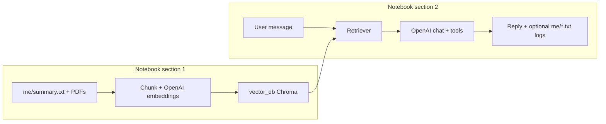

# Career chat (RAG + Gradio, Jupyter notebook)

This folder is a **community contribution** in the same spirit as other `community_contributions` examples: a **personal career assistant** that answers in your voice using **retrieval-augmented generation (RAG)** and a **Gradio** web UI. Everything lives in **one notebook** so you can run and tweak it step by step.

## What it is

- **`career_chat_rag.ipynb`** — The full solution:
  - **Section 1 — Ingest:** Read files under `me/` (PDF and `.txt`/`.md`), split into chunks, embed with **OpenAI** embeddings, save to local **`vector_db/`** (Chroma).
  - **Section 2 — Chat:** Retrieve top chunks per question, call the **OpenAI** chat API, and optionally use **tools** that append to **`me/leads.txt`** and **`me/unknown_questions.txt`**.

There is **no** external notification service: leads and unknown questions are **appended to local files** under `me/`.

## How it works (flow)

1. Add **`me/summary.txt`** and optionally **`me/linkedin.pdf`** (or other PDFs).
2. Open **`career_chat_rag.ipynb`** from the **`sammyloto`** directory (so `me/` and `vector_db/` paths work).
3. Run **Section 1** cells to build the index (re-run when your source files change).
4. Run **Section 2** cells to start Gradio. Each message:
   - **Retrieves** relevant passages from `vector_db/`.
   - **Generates** a reply with the chat model, using those passages as factual context.
   - Optionally **tool calls**: `record_user_details` → `me/leads.txt`, `record_unknown_question` → `me/unknown_questions.txt`.



## Environment variables (OpenAI)

Create a **`.env`** in this folder or use the repo root `.env` with:

- **`OPENAI_API_KEY`** — Your [OpenAI API key](https://platform.openai.com/api-keys).

Optional:

- **`CHAT_MODEL`** — Defaults to `gpt-4o-mini`.
- **`EMBEDDING_MODEL`** — Defaults to `text-embedding-3-large`.

The notebook uses the official OpenAI client and LangChain’s `OpenAIEmbeddings` with the default OpenAI base URL (no OpenRouter).

## Setup and run

```bash
cd community_contributions/sammyloto
python -m venv .venv
source .venv/bin/activate   # Windows: .venv\Scripts\activate
pip install -r requirements.txt
```

**If the notebook says `No module named 'langchain_chroma'`:** the kernel’s Python is not the one where you installed packages. Either select the venv as the Jupyter kernel in Cursor/VS Code, or run the **first code cell** in `career_chat_rag.ipynb` (`%pip install …`), which installs into the **active notebook kernel**.

Edit **`me/summary.txt`** and add **`me/linkedin.pdf`** if you like, then:

```bash
jupyter notebook career_chat_rag.ipynb
```

Or use **VS Code / Cursor** to open the notebook, select your interpreter, and **Run All** (or run section 1, then section 2). Stop the Gradio cell with the notebook **Interrupt** control when finished.

## Customization

- Set **`YOUR_NAME`** in the notebook’s config cell.
- Adjust **`TOP_K`**, **`CHUNK_SIZE`**, and **`CHUNK_OVERLAP`** in the same area as needed.

## Files you might see after use

| Path | Meaning |
|------|--------|
| `vector_db/` | Chroma database (rebuilt when you re-run the ingest cells) |
| `me/leads.txt` | Lines appended when the model records a user’s email |
| `me/unknown_questions.txt` | Questions the model could not answer from context |

---

*Pattern: aligned with other contributions that combine LangChain Chroma RAG, OpenAI, and Gradio for a “chat as me” demo—here packaged as a single notebook.*
