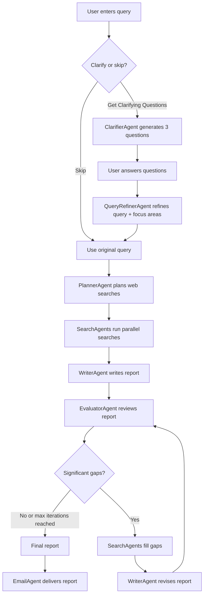

# Deep Research

Multi-agent research pipeline built with the OpenAI Agents SDK and Gradio. Asks clarifying questions to refine your query, runs parallel web searches, writes a detailed report, evaluates it for gaps, and optionally iterates to fill them.




## Setup

1. **Install dependencies** (from the repo root):

```bash
uv init
uv add openai openai-agents httpx
source .venv/bin/activate
uv sync
```

1. Create a .env file in this directory with:

```
OPENAI_API_KEY=sk-...
RESEND_API_KEY=re_...
MAIL_FROM=you@yourverifieddomain.com
MAIL_TO=recipient@example.com
```

**RESEND_API_KEY** / **MAIL_FROM** / **MAIL_TO** are only needed for the email delivery step. If you don't have a Resend account, the research and report still work — only the final email send will fail.

## Running

```sh
cd 2_openai/community_contributions/patrickcmd/deep_research
uv run deep_research.py
```

The Gradio UI opens in your browser at [http://127.0.0.1:7860](http://127.0.0.1:7860).

## Usage

1. Enter a research topic.
2. Click Get Clarifying Questions — answer the 3 questions to refine your search, then click Start Research. Or click Skip & Research Directly to go straight to the report.
3. The pipeline plans searches, runs them in parallel, writes a report, evaluates it for gaps (shown in the collapsible Evaluation Details section), and emails the final report.

