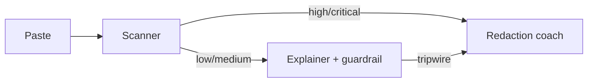

# Safe public paste — multi-agent orchestration

**Problem:** Developers paste logs, stack traces, and HTTP dumps into **public** forums. Those pastes often include **API keys, bearer tokens, emails, and internal IDs**.

**Solution:** A small [OpenAI Agents SDK](https://openai.github.io/openai-agents-python/) pipeline (same orchestration style as `2_openai/deep_research`):

1. **LeakScannerAgent** — structured risk scan (`ScanResult`).
2. **RedactionCoachAgent** — if risk is **high** or **critical**, only redaction guidance (no technical “explain” that could amplify secrets).
3. **ErrorExplainerAgent** — if risk is **low** or **medium**, explain the error; the agent has an **`input_guardrail`** (regex fast path + tiny classifier) as a second line of defense.

## Flow



## Setup

```bash
cd /path/to/agents   # repo root — use `uv` or activate `.venv`
export OPENAI_API_KEY=sk-...
```

`env_setup.load_repo_env()` loads the first `.env` found in this folder or a parent (typically the repo root).

## Run

### Gradio (standalone)

From the **repo root** (recommended, so `uv` uses `pyproject.toml`):

```bash
uv run python 2_openai/community_contributions/safe_paste_public/app.py
```

Or from **this** directory:

```bash
cd 2_openai/community_contributions/safe_paste_public
uv run --project ../../.. python app.py
python app.py   # if your shell already has the venv activated
```

### CLI (stream to stdout)

```bash
# repo root
uv run python 2_openai/community_contributions/safe_paste_public/run_demo.py \
  2_openai/community_contributions/safe_paste_public/sample_inputs/leaky_log.txt
```

From **this** directory:

```bash
uv run --project ../../.. python run_demo.py sample_inputs/clean_traceback.txt
python run_demo.py sample_inputs/leaky_log.txt
```

### Jupyter

Open `demo.ipynb` with the kernel working directory set to **`safe_paste_public`**. The notebook embeds **Gradio** (`inline=True`) and includes a cell that runs **`uv run`** on `run_demo.py` via `subprocess` from the detected repo root.

## Limitations (read this)

- **Educational / best-effort only.** This is **not** enterprise DLP. Models and regex **miss** secrets; false positives happen.
- **Never** paste real production secrets into demos — use fake values like the samples.
- If keys leak, **rotate them**; no tool undoes publication.

## Files

| File | Role |
|------|------|
| `models.py` | Pydantic schemas for structured outputs |
| `env_setup.py` | Load `.env` from this folder or parent dirs |
| `scanner_agent.py` | Risk classification |
| `redaction_coach_agent.py` | What to redact + safe example |
| `leak_guardrail.py` | `input_guardrail` before explain |
| `explainer_agent.py` | Diagnosis agent with guardrail attached |
| `orchestrator.py` | `SafePasteManager` + `trace` / `gen_trace_id` |
| `app.py` | Gradio UI (`build_ui()`, streaming markdown) |
| `run_demo.py` | CLI over the same orchestrator |
| `demo.ipynb` | Inline Gradio + `uv run` CLI example |

## Traces

Runs emit a link to the OpenAI trace viewer (same idea as Week 2 labs). See [Tracing](https://openai.github.io/openai-agents-python/) in the SDK docs.
