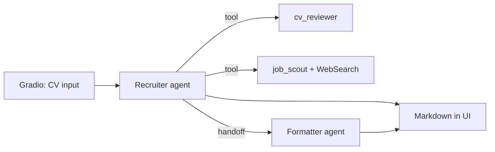

# Tobenna community contribution: `app.py`

**Inginia's Job Agency** is a small Gradio app that uses the [OpenAI Agents SDK](https://github.com/openai/openai-agents-python) (`agents` package) to review a CV, search the web for matching roles, and return a markdown report.

## What the app does

1. **UI**: A Gradio page titled *Inginia's Job Agency* with a large text box for the candidate’s CV and a markdown area for results.
2. **Trigger**: Clicking **Find Matching Jobs** runs an async pipeline (`find_matching_jobs`) wrapped in `trace("Recruiter")` for observability.
3. **Orchestrator**: A **Recruiter** agent receives the CV. It can call two tools and optionally hand off to a formatter:
  - `**cv_reviewer`** — another agent that parses the CV into structured fields (skills, years of experience, degrees, possible titles, seniority).
  - `**job_scout`** — an agent with `**WebSearchTool`** (`search_context_size="low"`) that returns structured job listings (title, company, location, description, URL).
  - **Handoff to Formatter** — an agent that turns job lists into clean markdown (sections per job), suitable for direct display.
4. **Output**: The recruiter’s final structured output is shown in the Gradio markdown panel. Instructions emphasize **markdown without code fences** so it renders nicely in the UI.

### Data models (Pydantic)


| Model       | Role                                                                                          |
| ----------- | --------------------------------------------------------------------------------------------- |
| `CVReview`  | Technical/soft skills, years of experience, degree flags, possible positions, seniority level |
| `Job`       | Single job: title, company, location, description, URL                                        |
| `JobSearch` | List of up to ~10 jobs from the scout                                                         |
| `Recruiter` | Remark (e.g. enough info in CV, whether matches were found) + list of `Job`                   |


### Command

From the **repository root**:

```bash
cd 2_openai/community_contributions/tobenna
uv run app.py
```

## Agent graph (conceptual)




