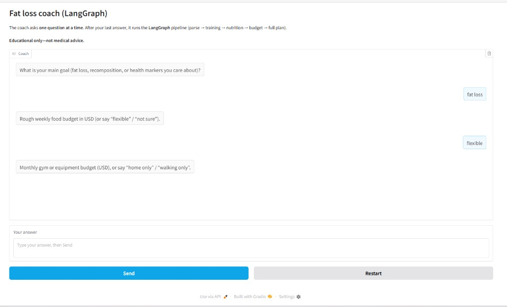

# Fat loss coach (LangGraph) — Week 4 community contribution

A small **LangGraph** pipeline: **parse user lifestyle & budget** → **exercise options** → **nutrition options** → **budget alignment** → **single markdown plan**.

**Not medical advice.** For education and coaching-style brainstorming only.

## Screenshot (Gradio UI)

The coach asks **one question at a time**; you answer in the box and click **Send**. After six answers, the graph runs once and returns the full plan.



## Graph

| Step | Node | Role |
|------|------|------|
| 1 | `parse_user` | Structured `ParsedProfile` from free text (`openai` structured output). |
| 2 | `exercise` | Training options (gym / home / walking) with time & injury constraints. |
| 3 | `nutrition` | Deficit + protein + meal-prep patterns; budget-aware swaps. |
| 4 | `budget` | Prioritize / tier by stated food + equipment budgets. |
| 5 | `finalize` | One weekly-style plan with disclaimer and “when to see a pro.” |

## Setup

Use the course repo venv and `OPENAI_API_KEY` in **`agents/.env`** at the repo root. `app.py` / `run.py` load that file even when you `cd` into this folder (so `python app.py` from here still finds your key).

## Run

```bash
cd 4_langgraph/community_contributions/abdussamadbello_fat_loss_coach
python app.py
```

`app.py` uses a **Gradio chat**: the coach asks **one question at a time** (six intake questions). After the last answer, **one** LangGraph run produces the full plan. Use **Restart** to begin again.

CLI:

```bash
python run.py "Your lifestyle, budget, goals, constraints..."
```

## Files

| File | Role |
|------|------|
| `coach_graph.py` | `StateGraph`, nodes, `compile()` |
| `app.py` | Gradio chat UI |
| `run.py` | CLI |
| `app_screenshot.png` | UI preview for README / PR |
| `README.md` | This file |

## Suggested PR title

`Week 4: LangGraph fat loss coach (Gradio intake + plan)`

## Suggested PR description (copy into GitHub)

Use your own words; example:

> I built a **fat loss coach** on **LangGraph** for Week 4: six **one-at-a-time** intake questions in **Gradio**, then a single graph run (parse profile → exercise → nutrition → budget → final markdown plan). `app.py` loads **`agents/.env`** from the repo root so the key works when you run from this folder. Screenshot is in the README. This is **educational only**, not medical advice. I learned how to wire **Gradio `State`** to a fixed interview before invoking the compiled graph.

## PR hygiene

```bash
git add 4_langgraph/community_contributions/abdussamadbello_fat_loss_coach/
git status   # only this folder (+ no secrets)
```

Clear notebook outputs if you add notebooks; do not commit `.env`.
